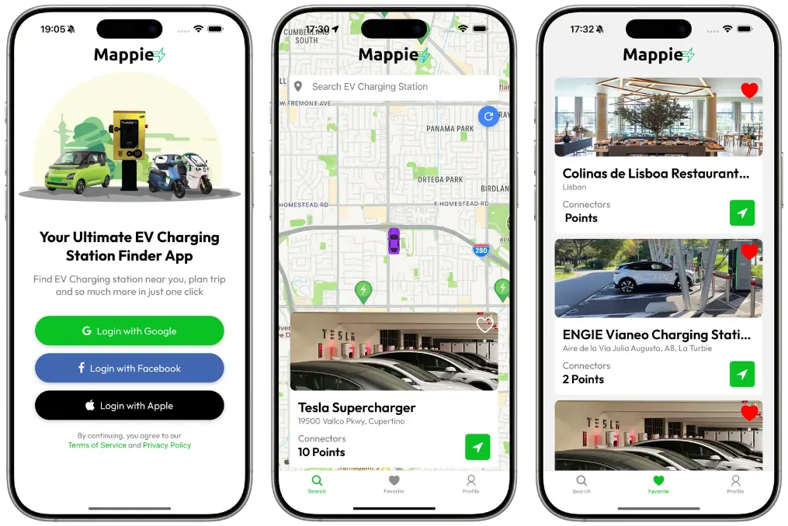

# 🔌 Mappie - Eletric Vehicle Charger Locator

**Created by:** João Ferreira nº2024501, Pedro Aleixo nº2023349

**Mappie** is a mobile application that helps users easily find nearby charging stations for electric vehicles or in specific locations.

<p align="center">
  
</p>

## 🚀 Funcionalidades

✔️ **Interactive Map** with nearby charging stations

✔️ **Location search** to find chargers in the area

✔️ **Navigation Integration** via Google Maps or Apple Maps

✔️ **Favorites** for quick access to frequently used stations

✔️ **Station details** with location photo, name, address, and available connector count

✔️ **User profile** with personalized preferences

✔️ **Secure Authentication** to store preferences

✔️ **Intuitive Interface** for easy use while driving

---

## 🛠️ Tecnologias Utilizadas

🔹 **Framework:** React Native 

🔹 **Platform:** Expo

🔹 **Maps:** Google Places API

🔹 **Navigation:** Integration with Google Maps and Apple Maps

🔹 **Authentication:** Clerk

🔹 **Database:** Firebase Firestore

🔹 **Location:** Geolocation Services

---

## 📦 Clone the Repository

```bash
git clone https://github.com/m4ferreirac/Mappie.git
```
